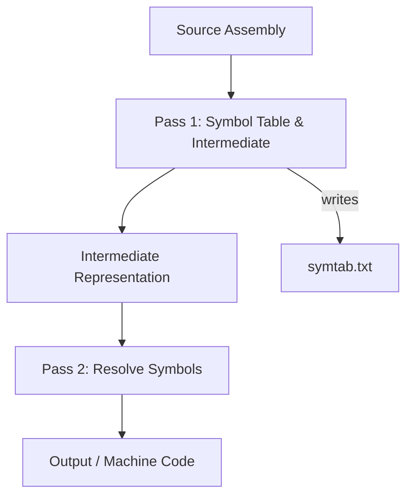

# My C Programs Collection

Professional collection of small C/C++ projects and lab exercises focused on assemblers, lexical analysis, and related compiler-toolchain components.

## Repository Overview
- **Purpose**: Educational implementations of two-pass assemblers, macro processors, lexical analysis, and simple example programs.
- **Languages**: C and C++ (gcc / g++)

## Repository Structure
- [hello_world.c](hello_world.c) — simple Hello World example.
- [twopassassembler.c](twopassassembler.c) — two-pass assembler implementation.
- [twopassassembler.cpp](twopassassembler.cpp) — C++ variant of the two-pass assembler.
- [lab01](lab01/) — two-pass assembler example and symbol table utilities (`twopass.c`, `symtab.txt`, `intermediate_code.txt`).
- [lab02](lab02/) — macro processing and supporting files (`macro2pass.c`, `intermediate_code.txt`).
- [lab03](lab03/) — lexical analysis implementation (`lexicalanalysis.c`).
- [two pass](two pass/) — alternate two-pass assembler folder (mirrors root assembler files).

Files used for examples and I/O:
- `input.txt`, `intermediate.txt`, `output.txt`, `symtab.txt`, `intermediate_code.txt`, `out.txt` (found in respective folders).

## Build Instructions
Use `gcc` for C files and `g++` for C++ files. Example commands:

```bash
gcc hello_world.c -o hello_world
./hello_world

gcc twopassassembler.c -o twopassassembler
./twopassassembler < input.txt > output.txt

g++ twopassassembler.cpp -o twopassassembler_cpp
./twopassassembler_cpp < input.txt > output.txt

gcc lab01/twopass.c -o lab01/twopass
./lab01/twopass < lab01/input.txt > lab01/out.txt

gcc lab02/macro2pass.c -o lab02/macro2pass
./lab02/macro2pass < lab02/input.txt > lab02/out.txt

gcc lab03/lexicalanalysis.c -o lab03/lexicalanalysis
./lab03/lexicalanalysis < lab03/input.txt
```

Adjust input/output redirection to the files present in each folder.

## Usage Notes
- Each assembler program typically reads an assembly source from `input.txt` and produces an intermediate file and/or `output.txt`.
- `symtab.txt` / `symf.txt` are symbol table outputs from Pass 1.
- If multiple assembler implementations exist, pick the one in the folder matching the lab you want to run.

## Algorithms and Design

### Two-Pass Assembler (high level)
1. Pass 1: Read source, assign addresses, record symbols in the symbol table, and produce an intermediate representation.
2. Pass 2: Use the intermediate representation and symbol table to generate final machine code or object-like output.

Key data structures: symbol table (label → address), opcode table (mnemonic → opcode/format), intermediate tuples (address, label, opcode, operand).

### Macro Two-Pass / Macro Processor (lab02)
1. Expand macro definitions while scanning source.
2. Replace macro invocations by expanding macro bodies and continuing assembly.

### Lexical Analysis (lab03)
- Tokenizes source into identifiers, keywords, literals, operators, and delimiters. Useful as the front-end of a compiler or assembler.

## Diagrams


## Contribution & Testing
- To test, compile the target program and run it with the sample `input.txt` in the same folder.
- If you add new test cases, please place them alongside the corresponding lab folder and update this README.

## License & Author
- Author: Repository owner
- License: Not specified — add a LICENSE file if you want an explicit license.

---
Created to provide clear build/run instructions and design notes for the included assembler and lexical analysis labs.
